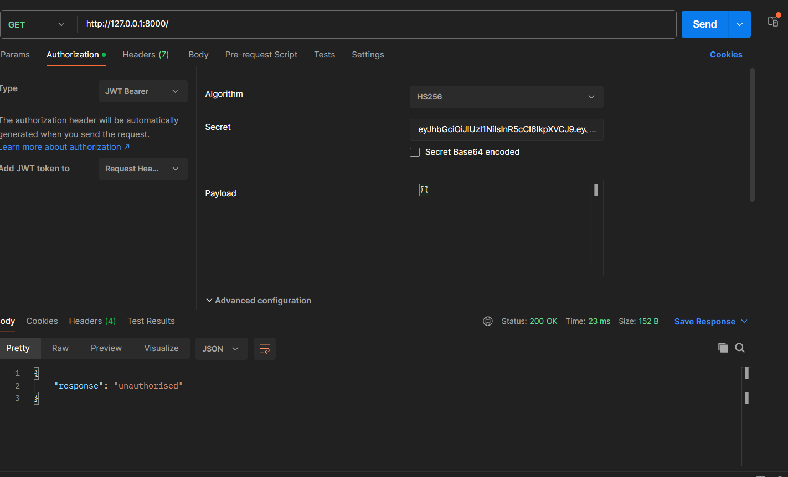

# Referral-System-API

Why FastAPi: FastAPI outperformed Django in terms of speed, and its description indicated that it is user-friendly and lightweight, which was a key factor in choosing it.

Unique ID: I generated a unique ID based on the current timestamp and then converted it to a hash.

1. User Registration Endpoint:
server response

refral id incrementing
