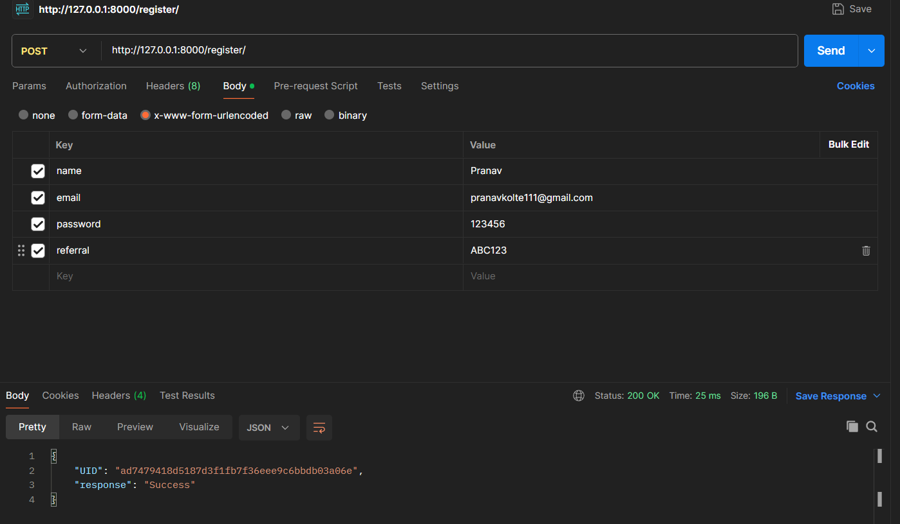
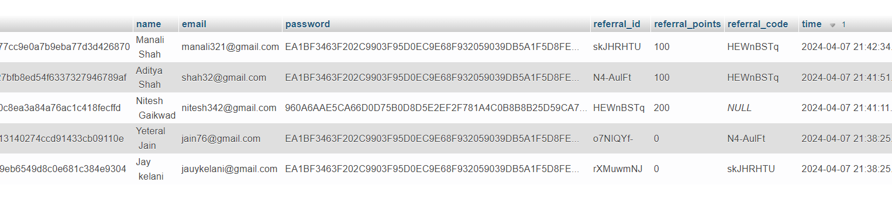
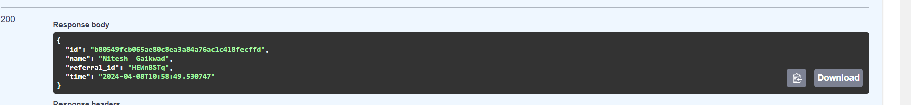
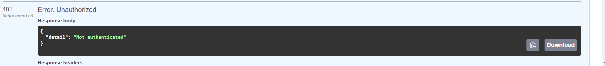
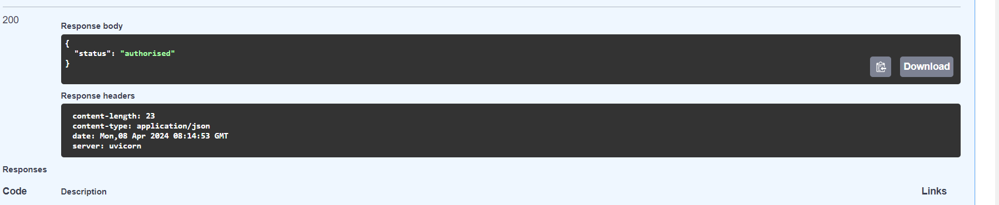
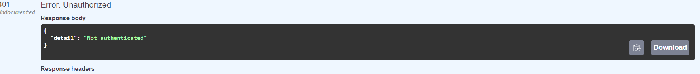
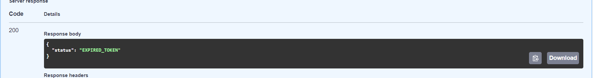
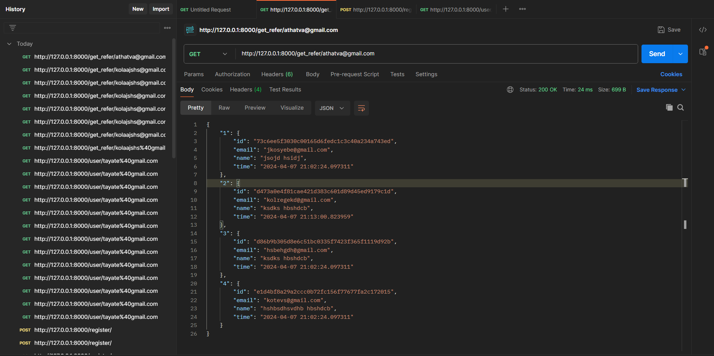
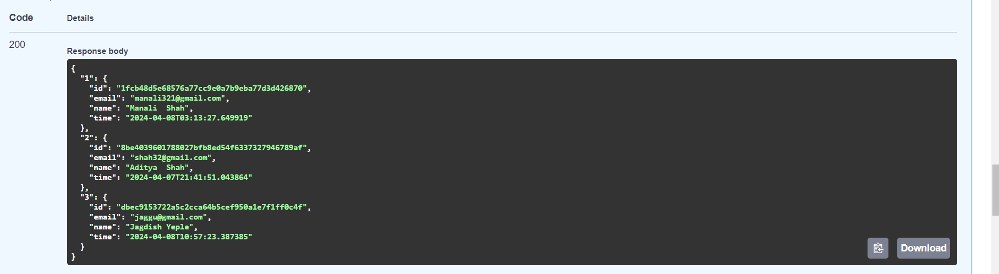
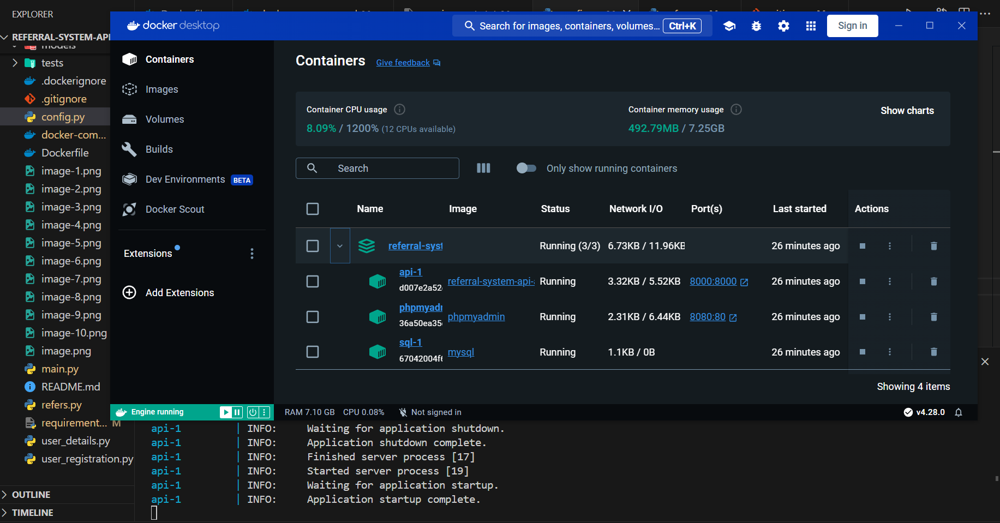

# Referral-System-API

The Referral System API is designed to streamline the process of user registration, referral tracking, and reward allocation. Built with FastAPI, it offers high performance, ease of use, and automatic documentation generation.

## Why Choose FastAPI over Django for this scenario?
FastAPI stands out for its exceptional speed and efficiency. Its architecture is designed to be intuitive and lightweight, which contributes to its high efficiency and scalable APIs. One of FastAPI’s most notable advantages is its automatic documentation feature, which offers concise guidance, **aligning perfectly with our project’s expectations as outlined in the documentation.**

### Referral Code Generation
Using current timestamps, we generate unique user IDs and secure them with hash transformations, ensuring the integrity and uniqueness of each identifier.

### Referral Reward 
Within our user database, we maintain two seprate columns:

- **`referral_code`**: Stores the referral code provided during registration.
- **`referral_id`**: Uniquely identifies each user. When a new user registers with an existing user's referral code, the system allocates reward points based on matching IDs.

## How It Works
1. A new user registers and provides a referral code.
2. The provided referral code is stored in the `referral_code` column.
3. The system matches this code with existing `referral_id` values.
4. If a match is found, the referring user receives reward points.

## Snapshots of Endpoints

## User Registration Endpoint:
server response

refral id incrementing

## user Details Endpoint:

**auth header token**

## Referrals Endpoint:

## docker engine
